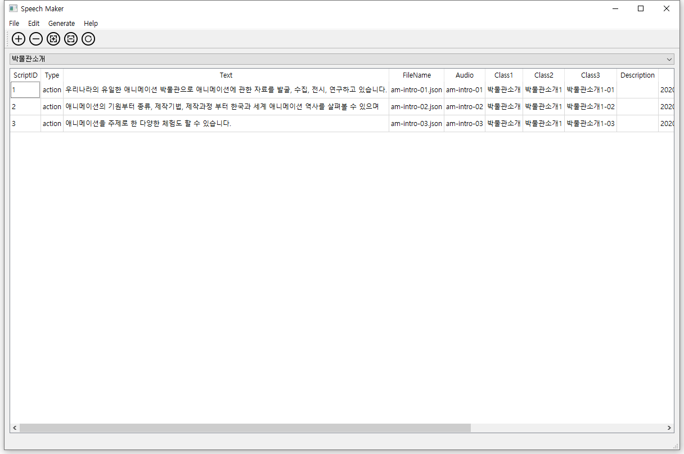

# speech-maker-arinbody

## 주요 기능
* ARINBody용 시나리오 데이터 베이스 생성
* 시나리오(대사)에 대응하는 음성 합성 및 입모양 데이터 생성(amazon polly 사용)

## 설치 환경
* python 3.7 환경
* dependencies:
    * pyqt5 
    * pyqt5-tools  
    * boto3 (AWS amazon polly 접근 라이브러리)

## 설치 및 실행 방법
본 코드는 아나콘다(anaconda 환경)환경에서 실행 확인하였습니다. 

1. 실행 환경 생성(anaconda 환경)

    * 아나콘다 환경 생성
        ```
        $ conda create --name SpeechMaker python=3.7
        ```
    * 아나콘다 환경 실행
        ```
        $ conda activate SpeechMaker
        ```
    * 필수 라이브러리 설치 
        ```
        (SpeechMaker)$ pip install pyqt5
        (SpeechMaker)$ pip install pyqt5-tools
        (SpeechMaker)$ pip install boto3
        ```

2. 소스 코드 설치(git clone)
    * 소스 다운로드 받기
        ```
        (SpeechMaker)$ git clone https://github.com/kyoungchinseo/speech-maker-arinbody.git
        ```
    * AWS ID/Key 값 코드에 넣기(main.py)
        
        코드 중 16,17열에 my_aws_id, my_aws_key의 문자열 값을 실제 aws polly 서비스용 id/key 값으로 교체해야 한다.
        ```
        # You should change two variables by your own AWS id/key values.
        my_aws_id = "Your ID"
        my_aws_key= "Your Key"
        ```
    * source 폴더 접근
        ```
        (SpeechMaker)$ cd speech-maker-arinbody\source
        ```
    * 프로그램 실행(main.py 실행시키기)
        ```
        (SpeechMaker)$ python main.py
        ```

## 데모 활용 방법



1. 데이터 베이스 부르기 
    * File > Load DB File 선택하고 작성한 데이터 베이스 파일(.db)을 선택한다.
    * 예제로 data 폴더에 animation_museum.db를 선택해보면 이해가 쉽다.
2. 데이터 베이스 새로 만들기
    * Edit > Create Database 를 선택하고 데이터 베이스 이름과 저장위치를 대화창에서 입력한다.
    * Edit > Create Table을 선택하면 새로 생성한 데이터베이스나 기존의 데이터 베이스에 새로 대사를 입력할 수 있는 테이블을 넣을 수 있다.
3. 대사 편집하기(툴바 다섯개 아이콘 활용)
    * Add (첫번째 아이콘): 테이블에 행(row) 추가되고 각 필드를 작성하면 된다.
    * Delete (두번째 아이콘): 테이블에 마지막 행이 제거 된다. 
    * Insert (새번째 아이콘): 선택한 행 다음에 새로운 행이 추가된다.
    * Remove (네번째 아이콘): 선택한 행이 제거된다.
    * Update (다섯번째 아이콘): 작성한 내용이 데이터 베이스에 업데이트된다.
4. 대사 행 필드 작성 안내
    * ScriptID: 테이블별로 1부터 차례로 기입하면 된다.
    * Type: 스크립트 타입으로 본 데모에서는 'action'하나로 통일되어 있으니 action을 입력하면 된다.
    * Text: 실제 캐릭터가 말할 대사를 입력하면 된다.
    * FileName: 스크립트 파일명으로 중복되지 않게 구조적으로 작성하면 되고 확장자 '.json'을 붙여야 한다.
    * Audio: 음성파일 이름으로 FileName 필드의 파일명과 동일하게 유지해야 한다.
    * Class1 / Class2 / Class3: 대사의 묶음으로 관리하기 위한 태그로 대사를 그룹별로 분류해서 입력해야 하고 반복되면 안된다.
    * Description: 스크립트의 특징을 설명하는 것으로 작성하지 않아도 된다. 
    * Date: 생성/업데이트 일자로 '업데이트'할 때마다 자동 갱신되니 입력하지 않아도 된다. 
5. 음성 파일 합성하기
    * Generate > Current Table을 선택하면 현재 보이는 테이블 내의 대사에 해당하는 음성파일과 입모양파일이 생성된다.
    * Generate > All을 선택하면 현재 로딩된 데이터 베이스 내의 전체 대사에 해당하는 음성파일과 입모양파일이 생성된다.
6. 생성한 파일/데이터베이스 옮기고 관리하기 
    * 생성한 데이터베이스(.db)와 생성한 음성파일(.wav, .marks)는 스크립트 에디터와 ARINBODY에서 파일을 옮겨서 사용한다.
    * 자세한 위치와 활용 방법은 스크립트 에디터와 ARINBODY 프로젝트를 참조하면 된다.
